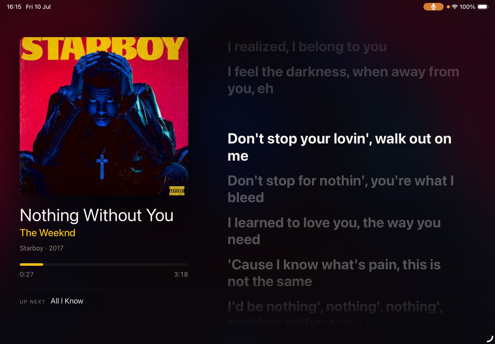
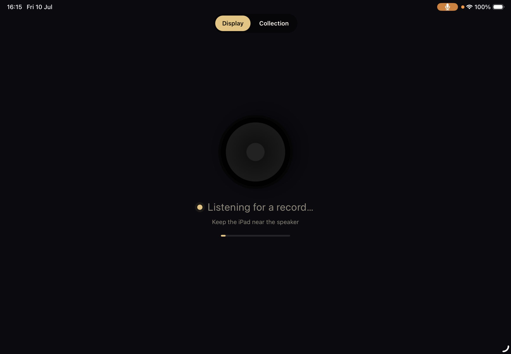
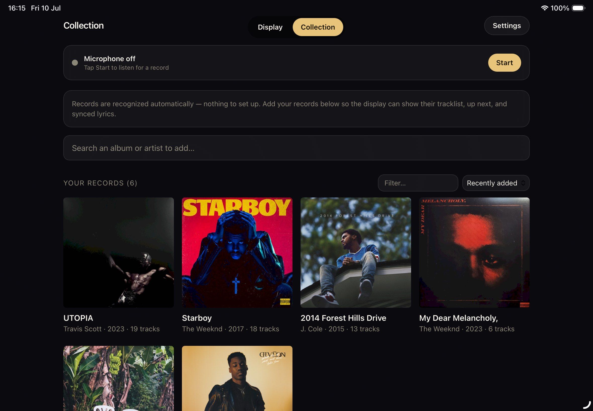

# Vinyl Display

Vinyl Display recognizes the record spinning on your turntable and shows it on
any screen: now playing, up next, album art, a progress bar, and time-synced
lyrics that scroll as the song plays.

It works like Shazam. Put on any record and it gets identified automatically.
There is nothing to set up on the turntable, no account, and no API key. An iPad
or phone near the speakers listens through its microphone and shows the display.
A small server does the matching and serves the web app, so it can run anywhere
on your network, including as a Docker container.

Add your records to a collection with a quick search and one tap. After that,
a recognized track from a saved album also shows the album's tracklist, an "up
next" preview, and lyrics and art cached locally for that record.



## Features

- **Automatic recognition.** No enrollment, no fingerprinting your own records.
  Drop the needle and the current track is identified within a few seconds.
- **Position-in-track sync.** The display knows how far into the song you are,
  so the progress bar and lyrics stay aligned with the music.
- **Scrolling synced lyrics.** A Spotify-style lyric view that follows the song
  line by line.
- **Personal collection.** Search an album, tap Add, and its tracklist, lyrics,
  and cover art are cached on the server for offline display.
- **Runs anywhere.** One container bundles the API and the built web app. Host
  it on a Raspberry Pi, a NAS, or any machine that runs Docker.
- **No accounts, no keys.** Recognition, metadata, and lyrics all come from
  free services that need no signup.
- **Optional fully-offline mode.** An alternate backend fingerprints and matches
  your records locally, with no internet needed at play time.

## The web app

The web app has two modes, switched with a toggle at the top:

- **Display** is the full-screen now-playing and lyrics view. This is what you
  leave open on the iPad.
- **Collection** is where you search and add records and change settings.

| Display, listening for a record | Collection |
|---|---|
|  |  |

```
iPad (Safari, https://vinyl.example.com)            Server (container, any host)
  mic -> Web Audio -> 10s WAV clip --POST /api/recognize--> Shazam -> {track, offset}
                                                             |-> your collection
                                                             |    (tracklist, art,
                                                             |     cached lyrics)
                                                             |-> LRCLIB (lyrics)
  websocket <----------------- now-playing state <-----------
```

## How it works

| Concern | Service | Account? |
|---|---|---|
| Recognition and position-in-track | Shazam, via [shazamio](https://github.com/shazamio/ShazamIO) | none |
| Tracklist, up next, and album art | MusicBrainz and Cover Art Archive | none |
| Time-synced lyrics | [LRCLIB](https://lrclib.net) | none |

The iPad captures about ten seconds of microphone audio, downsamples it, and
posts it to the server. The server identifies the track and works out where in
it you are. That result is matched against your collection. If the album is
saved, the display shows the full tracklist, the up-next preview, and the lyrics
and art that were cached when you added it. If the album is not saved, the track
still shows, with art from Shazam and lyrics fetched on the fly.

The frontend seeds a local clock with the reported offset and advances it for
smooth progress and lyric scrolling. It re-syncs every few seconds to absorb
turntable speed drift. Microphone processing such as echo cancellation, noise
suppression, and auto-gain is turned off so the music is not mangled before
matching.

## Requirements

- A host for the server. A Raspberry Pi 4 or 5 works, and so does any machine
  that runs Docker. It does not need to sit near the turntable.
- An iPad or phone near the turntable or speakers to listen and display.
- HTTPS. iOS only grants microphone access over HTTPS or localhost, so the
  server has to be reached over `https://`. The setup below uses Traefik to
  terminate TLS.

## Quick start

The server is one container that bundles the Olaf binary, the API, and the built
React app. Traefik handles TLS and routing.

```bash
git clone https://github.com/pira12/Vinyl-Display.git vinyl-display
cd vinyl-display
docker compose up -d --build
```

Notes:

- `docker-compose.yml` carries Traefik labels for a hostname on port 8080.
  Change the hostname, the `certresolver` name, and the external network to
  match your Traefik or Dokploy setup.
- State lives on the `vinyl-data` volume: the Olaf database, index, references,
  art cache, lyrics cache, and the auth token. It survives redeploys.
- The first build is slow because it compiles Olaf with Zig and builds the React
  app.
- On first start the server logs a `?token=...` link. Open it once on the iPad
  to unlock Collection mode. See [Security](#security).

## Deploying with Dokploy

If you point Dokploy at this repo as an **Application** with Build Type
`Dockerfile` instead of using the compose file, a few settings have to be set in
the Dokploy UI. They are not inferred from the Dockerfile.

1. **Build Type: Dockerfile.** Leave *Docker File* (defaults to `Dockerfile`),
   *Context Path* (defaults to `.`), and *Build Stage* (defaults to the last
   stage, the Python runtime) empty.
2. **Ports.** `EXPOSE 8080` only documents the port, it does not publish it. To
   reach the app at `http://<host>:8080`, add a port mapping under
   **Advanced > Ports**: host `8080` to container `8080`. For production, add a
   **Domain** with container port `8080` instead, so Traefik terminates TLS.
3. **Volume.** Add a volume under **Advanced > Volumes**: mount `vinyl-data` at
   `/data`. Without it, every redeploy wipes the collection. The compose file's
   `vinyl-data:/data` is not used by a Dockerfile-built Application.
4. **Rebuild without cache after changing dependencies.** A normal Dokploy
   rebuild can reuse a stale cached image, where every step shows `CACHED`, and
   keep serving the old container. Use Clean Cache or a no-cache rebuild.

### Host CPU requirement (numpy and x86-64-v2)

`shazamio >= 0.8` pulls in numpy 2.x, whose Linux wheels are built for the
x86-64-v2 CPU baseline. If the host CPU does not expose it, the container
crashes at startup with:

```
RuntimeError: NumPy was built with baseline optimizations:
(X86_V2) but your machine doesn't support: (X86_V2).
```

Bare-metal x86 hosts from around 2010 on are fine. A VM often masks the CPU
flags behind a generic model such as `kvm64` or `qemu64`, which triggers this
even though the physical CPU supports the instructions. On a TrueNAS SCALE,
Proxmox, or libvirt VM: stop the VM, set **CPU Mode** to **Host Passthrough**
(or Host Model), then start it. Verify from inside the guest that these flags
are listed:

```bash
grep -oE 'sse4_2|popcnt|avx' /proc/cpuinfo | sort -u
```

ARM hosts such as a Raspberry Pi are not affected. This is x86-only.

### Troubleshooting a deploy

- **"Container is not running" in Dokploy's log viewer.** It cannot attach to a
  crashed container. Read the crash on the host instead, which works on stopped
  containers:

  ```bash
  docker logs $(docker ps -aq --filter name=vinyldisplay | head -1) 2>&1 | tail -50
  ```

  A traceback ending in the `X86_V2` message above means the host CPU needs the
  fix in the previous section.
- **Blank page at `http://<host>:8080` but logs show `Uvicorn running`.** The
  port is not published. Add the Ports mapping.
- **Collection is empty after a redeploy.** The `/data` volume is not mounted.

## Using it

Open the app on the iPad and add it to the Home Screen for a full-screen
display. In Collection mode, tap **Start listening** and grant the microphone
when asked. Continuous listening runs while the app is in the foreground with
the screen awake. Put on a record and it shows up.

When a track that is not in your collection is recognized, the display offers a
one-tap **Save to collection** button. It finds the album, caches its tracklist,
lyrics, and art, and upgrades the display in place.

### Adding records to the collection

In Collection mode, search an album and tap **Add**. Search returns one row per
album rather than one per pressing, and adding picks the best release
automatically. It prefers an official vinyl release where possible, so track
positions come out as A1, B2, and so on. The tracklist, synced lyrics, and cover
art are fetched once and cached on the server. From then on, a recognized track
from that album gets the full display with tracklist, up next, and offline
lyrics and art.

### Settings

Collection mode has a **Settings** panel: audio device (for local line-in dev),
MusicBrainz User-Agent, silence threshold, sync intervals, speed factor, lyrics
on or off, minimum match score (Olaf only), and the recognition backend (shazam,
olaf, or mock). Most changes apply immediately. Device and backend changes apply
on the next restart. Saving rewrites the config file, so its comments are not
preserved.

### Start and stop listening

The **Start/Stop listening** button pauses recognition so it is not running
non-stop. While paused, the display shows "Paused" and the server does no
matching.

## The offline backend (Olaf)

The original self-hosted pipeline is still available. Set `recognition.backend`
to `olaf` in Settings. It fingerprints your own records with
[Olaf](https://github.com/JorenSix/Olaf) and matches fully offline, with no
internet needed at play time. The tradeoff is that each side has to be recorded
once through the iPad mic before it can be recognized. Choose it if you would
rather not depend on an online service. The recording UI reappears automatically
in this mode.

To record a side, play it from the beginning and tap **Record side A**. The iPad
streams it to the server, which fingerprints it and works out each track's start
time. A room microphone has a higher noise floor than a line input, so the
silent gaps between tracks can be harder to detect. The `audio.silence_rms`
setting tunes this, and it falls back to MusicBrainz track lengths when gaps are
not found. On the default Shazam backend, this step does not exist.

## Development

Run the backend and the Vite dev server separately. Microphone capture needs
HTTPS, so for mic testing use the deployed HTTPS host. The rest of the UI works
over localhost.

```bash
./scripts/setup_pi.sh                            # system deps, Olaf, a venv
./.venv/bin/python -m backend.main --simulate    # mock recognizer, no hardware

# in another shell:
cd frontend && npm install && npm run dev        # proxies /api, /ws, /art to :8080
```

`backend/main.py` also supports the original Raspberry Pi line-in path, where a
USB audio interface feeds the Pi, for local use. The container path uses the
iPad microphone instead.

Run the tests:

```bash
./.venv/bin/python -m pytest     # backend
cd frontend && npm run build     # frontend build check
```

## Privacy

An always-on microphone deserves a clear explanation, so here is exactly what
it does and does not do.

- **Audio goes to your own server, not a cloud.** You host Vinyl Display
  yourself. The iPad sends clips to the machine you run it on, over your own
  network. There is no Vinyl Display account or company backend.
- **It only listens while the app is open.** Continuous listening runs only
  after you tap Start, and only while the app is in the foreground with the
  screen awake. iOS shows its microphone indicator the whole time, and Stop
  listening pauses all capture.
- **Clips are transient.** The app keeps a short rolling buffer in memory and
  sends about ten seconds at a time. On the server each clip is written to a
  single scratch file, in RAM by default, that is overwritten on the next
  query. Audio is never archived and never logged.
- **What leaves your network depends on the backend.** With the `olaf` backend,
  recognition runs fully offline and no audio or audio-derived data leaves your
  network at all. With the default `shazam` backend, the clip is reduced to a
  spectral fingerprint and that fingerprint, not the audio, is sent to Shazam to
  identify the track.
- **The fingerprint cannot be turned back into sound.** A Shazam fingerprint
  keeps only sparse spectral peaks with no phase information, so the original
  audio, including any speech in the room, cannot be reconstructed from it. It
  can only reveal which known recording is playing, which is what identification
  needs. If you would rather not disclose even that, use the `olaf` backend.
- **Metadata lookups are text only.** Tracklists, lyrics, and cover art are
  fetched from MusicBrainz, LRCLIB, and the Cover Art Archive when you add an
  album, then cached locally. These are ordinary lookups by album title, not
  audio, and they need no account.

For the most private setup, use the `olaf` backend so recognition stays fully
on your own network.

## Security

The API can start audio capture and change settings, so it is treated as a
control surface.

- **Auth is off by default** so a home-LAN self-hoster can open the app and have
  it work. Set `REQUIRE_AUTH=1` when exposing the instance to the internet. This
  is strongly recommended in that case.
- **Token auth on `/api`** when enabled. Every management or control call then
  requires a token, passed as an `X-Auth-Token` header or a `?token=` query
  parameter. A random token is generated on first run, saved next to the
  database with mode `600`, and logged as a `?token=...` link. The first-run
  onboarding walks you through pasting it. You can pin your own with
  `AUTH_TOKEN`. Comparisons use `hmac.compare_digest`. `/healthz` reports
  `auth_required` so the app knows whether to ask.
- **The display stays open.** `/`, `/ws`, and `/art` are read-only and need no
  token. Only the collection, recording, recognition, and settings API is gated.
- **Input validation.** Release IDs are validated as MusicBrainz UUIDs before
  they touch a file path or index key. API bodies fail closed with `400`. The
  app fetches only MusicBrainz, LRCLIB, Cover Art, and Shazam URLs that it builds
  itself.
- **TLS** is terminated by Traefik. The container speaks plain HTTP internally
  and publishes no ports of its own.

## Project layout

```
backend/
  asgi.py            container entrypoint: builds a pure server from DATA_DIR
  main.py            local-dev entry (line-in or --simulate, runs the loop)
  config.py          YAML config to typed dataclasses
  settings.py        web-editable settings: validate, persist, apply live
  audio/             rolling buffer and silence splitting (line-in dev only)
  recognition/
    recognizer.py    resolve a match and publish now-playing state
    shazam.py        default backend: identify via Shazam, map to collection
    olaf.py          offline backend: shells out to the Olaf CLI
    mock.py          fake record for --simulate
    models.py        albums index and fuzzy find_track(); sides for Olaf
  metadata/          MusicBrainz and LRCLIB clients (cached)
  enrollment.py      add albums; client-fed mic enrollment and fingerprinting
  state.py           now-playing state and websocket fan-out
  server.py          API, websocket, /art, and serving the built SPA
frontend/            React, Vite, and Tailwind app
  src/hooks/useMic.js   shared mic engine: recognition and enrollment capture
  src/components/       Display, Collection grid, Settings, and mode bar
Dockerfile           Olaf (Zig) plus React build plus a slim Python runtime
docker-compose.yml   Traefik labels for the deployment
```

## Notes and limitations

- iOS needs HTTPS and a user tap to start the microphone. Continuous listening
  only runs while the app is foregrounded with the screen awake.
- The Shazam backend rides an unofficial but widely used API and needs internet
  at play time. If that is a problem, the Olaf backend matches fully offline at
  the cost of recording each side once.
- Lyrics and art for collection albums are cached when the album is added. If
  MusicBrainz or LRCLIB are unreachable at that moment, the app falls back to a
  local tracklist and omits lyrics and art.
- Olaf's CLI columns have shifted between versions. If Olaf recognition matches
  but shows the wrong track or offset, adjust the `COL_*` constants in
  `backend/recognition/olaf.py`.

## Contributing

Contributions are welcome. See [CONTRIBUTING.md](CONTRIBUTING.md) for dev setup
and the test commands.

## License

Released under the [MIT License](LICENSE).
